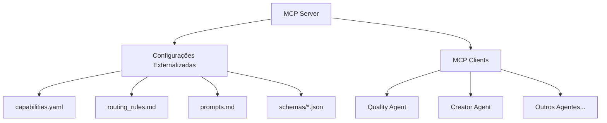

# Arquitetura MCP Otimizada com Regras Externalizadas

## 1. Princípios Fundamentais

### 1.1 Visão Geral da Arquitetura


### 1.2 Separação de Responsabilidades
- **MCP Server**: Orquestrador central com regras de roteamento externalizadas
- **MCP Clients**: Executores especializados com capacidades bem definidas
- **Regras & Configurações**: Totalmente externalizadas em arquivos YAML/MD

### 1.2 Fontes de Verdade
```yaml
# config/sources.yaml
configuration_sources:
  capabilities: "config/capabilities.yaml"    # registro de capacidades
  routing_rules: "config/routing_rules.md"   # regras de roteamento
  gemini_prompts: "config/prompts.md"        # templates de prompts
  client_schemas: "config/schemas/*.json"     # contratos de comunicação
```

### 1.3 Princípio de Interoperabilidade e Integração com LLMs
O `MCPServer` deve atender aos seguintes requisitos para garantir integração efetiva com LLMs e IDEs:

1. **API RESTful Padronizada**
   - Endpoint `/analyze` para receber solicitações no formato MCPRequest
   - Endpoint `/capabilities` para expor capacidades disponíveis
   - Autenticação via API key para integrações seguras

2. **Integração com LLMs**
   - **Gemini**: 
     - Formato de resposta compatível com Gemini Structured Output
     - Suporte ao modo de análise rápida (Gemini-Flash)
   - **Claude Desktop**:
     - Implementação do protocolo de comunicação Claude
     - Suporte a análise contextual de código
   - **GitHub Copilot/Cursor**:
     - Compatibilidade com VSCode Extension API
     - Suporte a análise incremental de código

3. **Formato de Comunicação**
```yaml
# schemas/mcp_request.yaml
type: object
required:
  - content
  - source
  - context
properties:
  content:
    type: string
    description: "Conteúdo da solicitação"
  source:
    type: string
    enum: ["gemini", "claude", "copilot", "cursor"]
    description: "Origem da solicitação"
  context:
    type: object
    description: "Contexto específico do LLM"
```

4. **Headers Específicos**
```http
X-LLM-Source: {gemini|claude|copilot|cursor}
X-LLM-Version: string
X-LLM-Capabilities: array[string]
```

## 2. Estrutura de Arquivos de Configuração

### 2.1 Registro de Capacidades
```yaml
# config/capabilities.yaml
clients:
  quality_agent:
    id: "quality_agent"
    match:
      intent: ["code_review", "quality_analysis"]
      domains: ["python", "typescript"]
    constraints:
      max_tokens: 8000
      allowed_actions: ["analyze", "suggest"]
  creator_agent:
    id: "creator_agent"
    match:
      intent: ["create_agent", "modify_agent"]
      domains: ["agents", "prompts"]

routing:
  confidence_threshold: 0.65
  topk: 2
  conflict_policy: "prefer_specific"
  fallback_policy: "respond_direct"
```

### 2.2 Regras de Roteamento
```markdown
# config/routing_rules.md

## Regras de Priorização
1. Correspondência exata de intent: +0.5 pontos
2. Correspondência de domínio: +0.3 pontos por domínio
3. Penalidade por restrições: -0.2 pontos

## Política de Divisão de Tarefas
- Dividir se detectar múltiplos intents
- Dividir se houver dependências sequenciais
- Máximo de 3 subtarefas por solicitação

## Condições de Fallback
1. Nenhum match acima do threshold
2. Violação de restrições de cliente
3. Capacidades requeridas não disponíveis
```

### 2.3 Templates de Prompts
```markdown
# config/prompts.md

## Análise de Solicitação
\`\`\`template
SYSTEM
Você é um analisador de solicitações para um sistema MCP.
Analise a solicitação e retorne apenas JSON válido no formato:
{
  "intent": "string",
  "domains": ["string"],
  "subtasks": [{"title": "string", "reason": "string"}],
  "confidence": 0..1
}

CONTEXT
{available_capabilities}

USER_REQUEST
{user_text}
\`\`\`

## Resposta Fallback
\`\`\`template
SYSTEM
Você é um assistente de suporte.
Responda de forma breve e técnica, sem assumir capacidades não listadas.
Prefixo obrigatório: "{preamble}"

USER_REQUEST
{user_text}
\`\`\`
```

## 3. Implementação do MCP Server

```python
class MCPServer:
    def __init__(self):
        self.config = self._load_configurations()
        self.router = self._initialize_router()
        self.gemini = self._initialize_gemini()

    def _load_configurations(self):
        """Carrega todas as configurações externas"""
        config_sources = yaml.safe_load("config/sources.yaml")
        return {
            "capabilities": self._load_yaml(config_sources["capabilities"]),
            "routing_rules": self._load_markdown(config_sources["routing_rules"]),
            "prompts": self._load_markdown(config_sources["gemini_prompts"])
        }

    async def handle_request(self, request: MCPRequest) -> MCPResponse:
        # 1. Identificar fonte do LLM e ajustar análise
        llm_source = request.headers.get("X-LLM-Source", "default")
        llm_capabilities = request.headers.get("X-LLM-Capabilities", [])
        
        # 2. Análise adaptada ao LLM fonte
        analysis = await self._analyze_with_llm(
            llm_source=llm_source,
            capabilities=llm_capabilities,
            template=self.config["prompts"]["análise_solicitação"],
            context={
                "available_capabilities": self.config["capabilities"],
                "llm_context": request.context
            },
            content=request.content
        )

        # 3. Aplicar regras de roteamento com contexto do LLM
        routing_decision = self.router.apply_rules(
            analysis=analysis,
            rules=self.config["routing_rules"],
            llm_context={
                "source": llm_source,
                "capabilities": llm_capabilities
            }
        )

        # 3. Processar decisão ou fallback
        if routing_decision.is_valid():
            return await self._process_valid_routing(routing_decision)
        else:
            return await self._handle_fallback(request, analysis)
```

## 4. Implementação do MCP Client

```python
class BaseMCPClient:
    def __init__(self, client_id: str):
        self.config = self._load_client_config(client_id)
        self.capabilities = self.config["match"]
        self.constraints = self.config["constraints"]
        
        # Inicializar adaptadores para diferentes LLMs
        self.llm_adapters = {
            "gemini": GeminiAdapter(),
            "claude": ClaudeAdapter(),
            "copilot": CopilotAdapter(),
            "cursor": CursorAdapter()
        }
        
    async def format_response(self, response: MCPResponse, llm_source: str) -> Dict:
        """Formata resposta de acordo com o LLM fonte"""
        adapter = self.llm_adapters.get(llm_source)
        if not adapter:
            raise ValueError(f"LLM não suportado: {llm_source}")
            
        return await adapter.format_response(response)

    def _load_client_config(self, client_id: str):
        """Carrega configuração específica do cliente do capabilities.yaml"""
        all_configs = yaml.safe_load("config/capabilities.yaml")
        return all_configs["clients"][client_id]

    async def validate_task(self, task: MCPTask) -> bool:
        """Valida se a tarefa está dentro das restrições do cliente"""
        return all(
            self._check_constraint(key, value)
            for key, value in self.constraints.items()
        )
```

## 5. Benefícios e Guias Práticos

### 5.1 Manutenibilidade
1. **Atualização de Regras**
   ```bash
   # 1. Fazer backup da regra atual
   cp config/routing_rules.md config/routing_rules.backup.md
   
   # 2. Editar regra
   nano config/routing_rules.md
   
   # 3. Validar alterações
   ./validate_rules.sh routing_rules.md
   
   # 4. Se houver erro, restaurar backup
   cp config/routing_rules.backup.md config/routing_rules.md
   ```

2. **Versionamento**
   ```git
   # Commit específico para regras
   git add config/*.{yaml,md,json}
   git commit -m "rules: atualiza regras de roteamento"
   ```

### 5.2 Flexibilidade e Extensibilidade
1. **Adição de Novo Cliente**
   ```yaml
   # config/capabilities.yaml
   clients:
     new_agent:
       id: "new_agent"
       match:
         intent: ["nova_capacidade"]
         domains: ["novo_dominio"]
       constraints:
         max_tokens: 5000
   ```

2. **Customização de Prompts**
   ```markdown
   # config/prompts.md
   ## Novo Template
   \`\`\`template
   SYSTEM
   Você é um especialista em {dominio}.
   {regras_especificas}
   
   USER_REQUEST
   {user_text}
   \`\`\`
   ```

### 5.3 Rastreabilidade e Logging
1. **Estrutura de Logs**
   ```python
   async def log_decision(self, decision: RoutingDecision):
       log_entry = {
           "timestamp": datetime.utcnow(),
           "request_id": decision.request_id,
           "applied_rules": decision.rules_used,
           "confidence": decision.confidence,
           "result": decision.result
       }
       await self.logger.info("routing_decision", log_entry)
   ```

2. **Auditoria**
   ```sql
   -- Consulta de Decisões
   SELECT 
       date_trunc('hour', timestamp) as hora,
       COUNT(*) as total_decisoes,
       AVG(confidence) as confianca_media,
       COUNT(CASE WHEN result='fallback' THEN 1 END) as fallbacks
   FROM routing_decisions
   GROUP BY 1
   ORDER BY 1 DESC;
   ```

## 6. Práticas de Implementação e Monitoramento

### 6.1 Validação de Configurações
```python
from pydantic import BaseModel, Field
from typing import List, Dict

class ClientConfig(BaseModel):
    id: str
    match: Dict[str, List[str]]
    constraints: Dict[str, Any]

class RoutingConfig(BaseModel):
    confidence_threshold: float = Field(ge=0.0, le=1.0)
    topk: int = Field(ge=1, le=10)
    conflict_policy: str
    fallback_policy: str

def validate_configs():
    # Carregar e validar capabilities.yaml
    config = yaml.safe_load(open("config/capabilities.yaml"))
    for client_id, client_data in config["clients"].items():
        ClientConfig(**client_data)
    RoutingConfig(**config["routing"])
```

### 6.2 Tratamento de Erros
```python
class MCPError(Exception):
    """Classe base para erros MCP"""
    pass

class ConfigurationError(MCPError):
    """Erro em arquivos de configuração"""
    pass

class RoutingError(MCPError):
    """Erro durante roteamento"""
    pass

async def handle_error(error: MCPError) -> MCPResponse:
    if isinstance(error, ConfigurationError):
        # Notificar admin e usar configuração de backup
        await notify_admin(error)
        return await use_backup_config()
    elif isinstance(error, RoutingError):
        # Tentar fallback ou dividir tarefa
        return await attempt_fallback()
```

### 6.3 Sistema de Monitoramento
1. **Métricas Chave**
   ```python
   @dataclass
   class MCPMetrics:
       # Eficácia do Roteamento
       routing_success_rate: float
       avg_confidence: float
       fallback_rate: float
       
       # Performance
       avg_response_time: float
       gemini_latency: float
       
       # Saúde do Sistema
       active_clients: int
       error_rate: float
       
   async def collect_metrics(self) -> MCPMetrics:
       """Coleta métricas em tempo real"""
       return MCPMetrics(
           routing_success_rate=await self._calc_success_rate(),
           avg_confidence=await self._calc_avg_confidence(),
           # ... outros cálculos
       )
   ```

2. **Dashboards e Alertas**
   ```yaml
   # config/monitoring.yaml
   dashboards:
     routing_health:
       refresh_rate: "1m"
       panels:
         - title: "Taxa de Sucesso do Roteamento"
           metric: "routing_success_rate"
           alert_threshold: 0.95
         - title: "Confiança Média"
           metric: "avg_confidence"
           alert_threshold: 0.75
   
   alerts:
     high_fallback_rate:
       condition: "fallback_rate > 0.1"
       channels: ["slack", "email"]
       message: "Taxa de fallback acima do normal"
     
     low_confidence:
       condition: "avg_confidence < 0.7"
       channels: ["slack"]
       message: "Confiança média baixa nas decisões"
   ```

## 7. Próximos Passos

1. **Automação**
   - Ferramenta para validar arquivos de regras
   - CLI para testar regras localmente
   - Documentação automática de configurações

2. **Melhorias**
   - Interface web para edição de regras
   - Testes A/B de configurações
   - Análise de impacto de mudanças