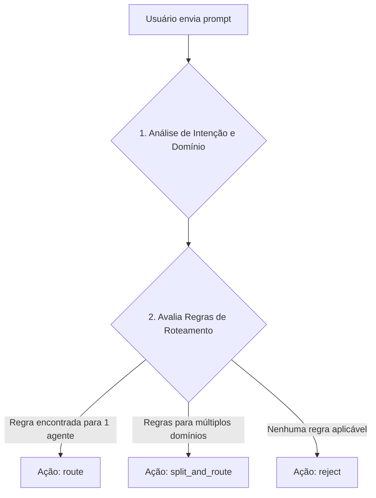

# Base de Conhecimento e Regras do Agente Roteador

Este documento detalha a lógica e os procedimentos que governam o Agente Roteador.

## 1. Fluxo de Decisão Principal

O roteamento segue uma lógica estrita para garantir consistência.



## 2. Regras de Roteamento (Exemplos)

As regras são a base da decisão. Elas mapeiam palavras-chave e intenções para agentes específicos.

| Nome da Regra | Condição (Keywords) | Agente de Destino |
| :--- | :--- | :--- |
| **CriacaoDeAgente** | `criar agente`, `novo agente`, `padrão de agente` | `AgenteCreator` |
| **MelhoriaDeQualidade**| `melhorar agente`, `contradição`, `ajustar regra` | `AgenteQualidade` |
| **DefinicaoDeNegocio**| `regras de negócio`, `política de uso`, `fluxo` | `AgenteNegocio` |
| **DesenhoTecnico** | `arquitetura`, `diagrama`, `banco de dados`, `API` | `AgenteArquiteto` |
| **CriacaoDeFluxo** | `fluxo`, `diagrama`, `sequência`, `fluxograma` | `AgenteDeFluxos` |

## 3. Lógica de Execução (Pseudocódigo)

```python
def processar_solicitacao(prompt_usuario):
    # 1. Detectar domínios e intenções no prompt
    dominios_detectados = detectar_dominios(prompt_usuario) # Ex: ['creator', 'qualidade']

    if len(dominios_detectados) == 0:
        # 2. Se nenhum domínio conhecido for encontrado, rejeita
        return gerar_rejeicao(prompt_usuario)

    elif len(dominios_detectados) == 1:
        # 3. Se apenas um domínio for encontrado, rota simples
        agente_alvo = encontrar_agente_por_dominio(dominios_detectados[0])
        return gerar_rota_simples(agente_alvo, prompt_usuario)

    else:
        # 4. Se múltiplos domínios forem encontrados, divide a tarefa
        partes_prompt = dividir_prompt_por_dominio(prompt_usuario, dominios_detectados)
        return gerar_rota_dividida(partes_prompt)
```

## 4. Protocolos Especiais

### Protocolo de Recusa e Re-roteamento
1.  Um agente especialista recusa uma tarefa com `{"status": "rejected", "reason": "out_of_scope", "suggestion": "AgenteQualidade"}`.
2.  O **AgenteRoteador** recebe esta recusa.
3.  **Ação:** Loga o evento, consulta suas regras para a sugestão (`AgenteQualidade`) e reencaminha o prompt original para o agente sugerido, sem consultar o usuário.
4.  Se um loop de recusas for detectado (2 recusas para a mesma tarefa), a tarefa é escalada para o `AgenteQualidade` para análise de falha de roteamento.

### Protocolo de Sugestão de Criação
1.  Se nenhuma regra de roteamento for aplicável, o Roteador não encontra um agente.
2.  **Ação:** Responde ao usuário com uma mensagem de rejeição e uma sugestão: “Nenhum agente cobre esta solicitação. Deseja que eu peça ao **AgenteCreator** para avaliar a criação de um novo agente para esta função?”.
3.  Se o usuário confirmar, o Roteador cria uma solicitação formal na caixa de entrada do `AgenteCreator` (`/shared/agente_creator/`).
