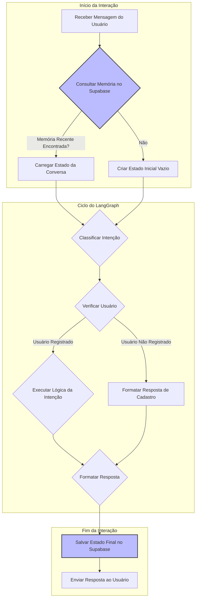

# 02. Gerenciamento de Estado e Memória com LangGraph

## 1. Visão Geral da Arquitetura de Conversa

O núcleo da nossa lógica de processamento de mensagens é construído sobre um poderoso trio de ferramentas da LangChain:

- **LangGraph**: Utilizado para criar um grafo de estados cíclico e robusto. Em vez de um fluxo linear, o LangGraph nos permite modelar a conversa como uma máquina de estados, onde cada nó representa uma etapa de processamento e as arestas representam as transições entre essas etapas.
- **LangChain**: Fornece os blocos de construção fundamentais, como a integração com o modelo `ChatGemini`, os templates de prompt e as cadeias de processamento.
- **LangSmith**: Essencial para a observabilidade. Ele nos dá visibilidade total sobre a execução do grafo, permitindo depurar, monitorar e avaliar o comportamento do sistema em cada etapa.

## 2. O Estado da Conversa (Memória de Curto Prazo)

O conceito central no LangGraph é o **Estado** (`State`). Ele funciona como a memória de curto prazo da conversa. Para cada interação do usuário, um objeto de estado é criado e passado entre os nós do grafo. Cada nó pode ler e modificar esse estado.

Nosso estado, `ReservationState`, armazena informações vitais como:
- `user_message`: A mensagem mais recente do usuário.
- `phone_number`: O identificador do usuário.
- `intent`: A intenção classificada pelo Gemini.
- `sql_query` e `sql_result`: A consulta SQL gerada e seu resultado.
- `response`: A resposta a ser enviada ao usuário.
- `user_id` e `is_registered`: Informações de cadastro do usuário.

Manter esse estado é o que permite que o sistema saiba que, após verificar a disponibilidade, o próximo passo lógico é, por exemplo, perguntar se o usuário deseja fazer uma reserva.

## 3. Memória de Longo Prazo com Supabase

Um desafio comum em chatbots é a **persistência da conversa**. O que acontece se um usuário para de responder e retoma a conversa horas ou dias depois? A memória de curto prazo (o objeto `State` em execução) é perdida.

Para resolver isso, implementamos uma **memória de longo prazo** utilizando o Supabase.

### 3.1. Como Funciona

1.  **Armazenamento do Estado**: Ao final de cada interação significativa (ou após um período de inatividade), o estado atual da conversa (`ReservationState`) é serializado (convertido para JSON) e salvo em uma tabela no Supabase chamada `conversational_memory`.
2.  **Recuperação do Estado**: Quando um novo usuário envia uma mensagem, o sistema primeiro consulta a tabela `conversational_memory` para ver se existe um estado de conversa recente para aquele `phone_number`.
3.  **Reidratação da Conversa**: Se um estado recente for encontrado, ele é carregado e usado como o ponto de partida para o LangGraph. Isso "reidrata" a conversa, permitindo que o sistema se lembre do contexto anterior, mesmo que a interação tenha sido interrompida por um longo período.

### 3.2. Fluxo com Gerenciamento de Memória

O fluxograma a seguir ilustra como a memória de longo prazo se integra ao fluxo principal.

Esta abordagem garante que o assistente seja contextual e útil, capaz de manter conversas coerentes e contínuas ao longo do tempo, melhorando significativamente a experiência do usuário.
