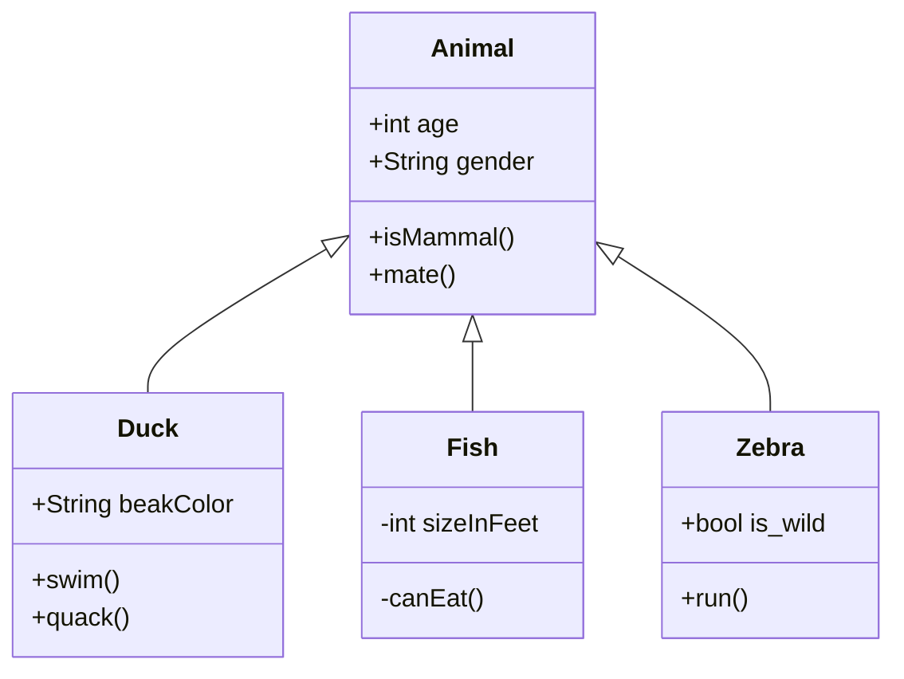

Este é um exemplo básico de diagrama de classe Mermaid. Para a sintaxe completa e mais exemplos, consulte a documentação oficial do Mermaid.

**Nota sobre Caracteres Especiais em Rótulos de Nós (Diagramas de Fluxo):**
Para incluir caracteres especiais como `(`, `)`, `:`, `;`, ou hífens em rótulos de nós (`[ ]` ou `{ }`) em diagramas de fluxo (`graph TD`, `LR`, etc.), **é altamente recomendado envolver todo o texto do rótulo em aspas duplas (`""`)**. Isso garante que o Mermaid interprete o conteúdo como uma string literal, evitando erros de sintaxe. Exemplo: `A["Texto com: (caracteres) - especiais;"]`.

**Instruções para Referência e IA em Diagramas:**

1.  **Referência a Documentos:** Ao referenciar um documento externo (ex: `02.docs/03.objetivo/09.whatsapp_reservation_system.md`), utilize o formato `[Nome do Documento](caminho/para/o/documento.md)`. Para referenciar um fluxo específico, use `[Nome do Fluxo](caminho/para/o/fluxo.mmd)`. Se o documento ou fluxo for o atual, pode-se usar apenas o nome.

2.  **Instruções para IA:** Para adicionar instruções ou contexto para a IA dentro do diagrama, utilize comentários Mermaid. Estes comentários não são renderizados no diagrama final, mas são visíveis no código-fonte e podem ser lidos pela IA. Formato: `%% [INSTRUÇÃO PARA IA]: Texto da instrução.`
    *   **Exemplo:** `%% [IA]: Este nó representa a validação de dados de entrada.`

3.  **Sincronização:** Garanta que as referências e instruções estejam sempre sincronizadas entre os documentos de texto e os diagramas de fluxo.