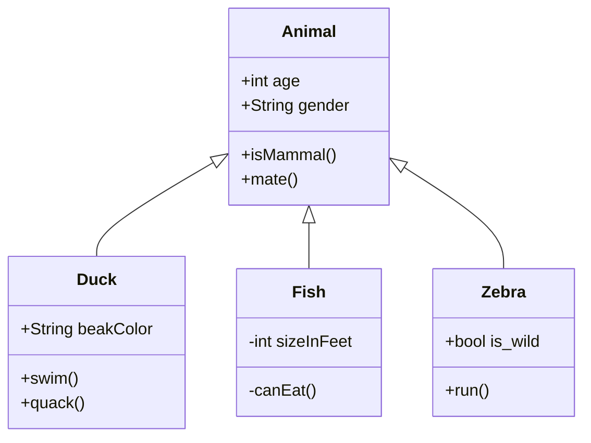

Este é um exemplo básico de diagrama de classe Mermaid. Para a sintaxe completa e mais exemplos, consulte a documentação oficial do Mermaid.

**Nota sobre Caracteres Especiais em Rótulos de Nós (Diagramas de Fluxo):**
Ao criar diagramas de fluxo (`graph TD`, `LR`, etc.), evite o uso de caracteres especiais como `(`, `)`, `:`, `;`, ou hífens soltos diretamente dentro dos rótulos dos nós `[ ]` ou `{ }`. Isso pode causar erros de sintaxe no Mermaid. Prefira usar espaços para separar palavras, ou se for essencial, consulte a documentação do Mermaid para métodos de escape ou formatação específica.