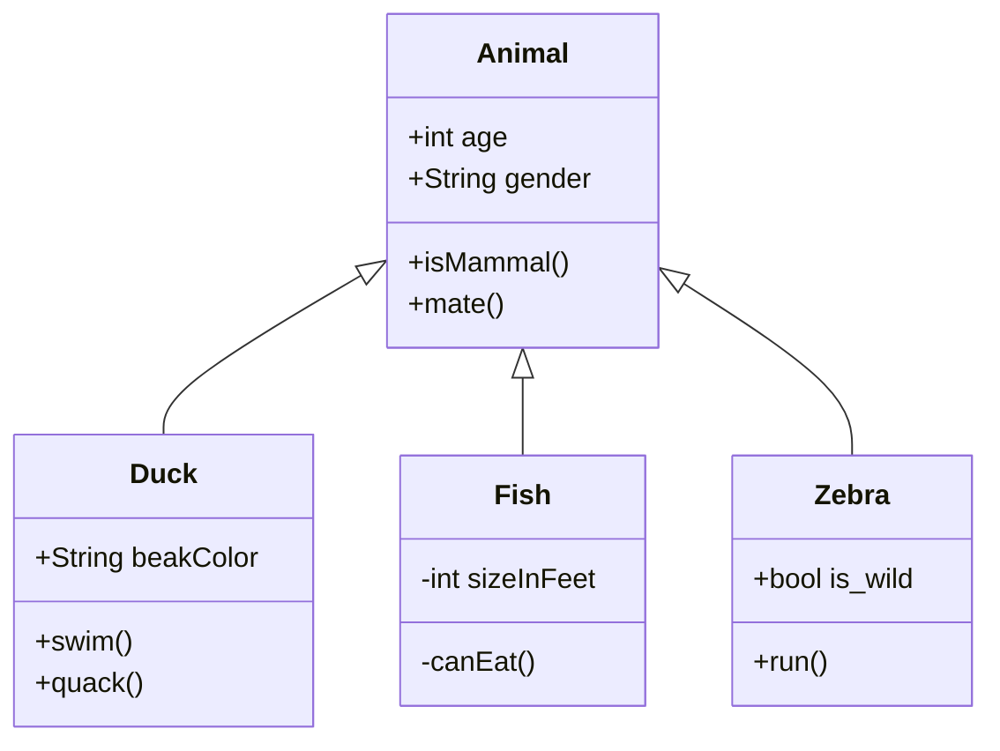

Este é um exemplo básico de diagrama de classe Mermaid. Para a sintaxe completa e mais exemplos, consulte a documentação oficial do Mermaid.

**Nota sobre Caracteres Especiais em Rótulos de Nós (Diagramas de Fluxo):**
Para incluir caracteres especiais como `(`, `)`, `:`, `;`, ou hífens em rótulos de nós (`[ ]` ou `{ }`) em diagramas de fluxo (`graph TD`, `LR`, etc.), **é altamente recomendado envolver todo o texto do rótulo em aspas duplas (`""`)**. Isso garante que o Mermaid interprete o conteúdo como uma string literal, evitando erros de sintaxe. Exemplo: `A["Texto com: (caracteres) - especiais;"]`.