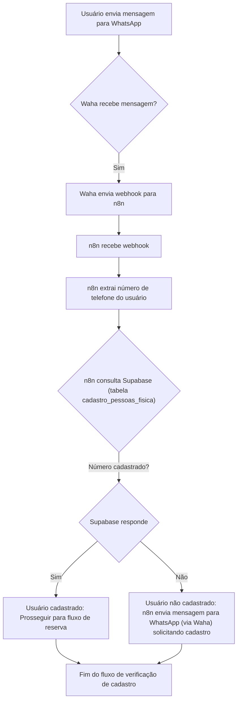
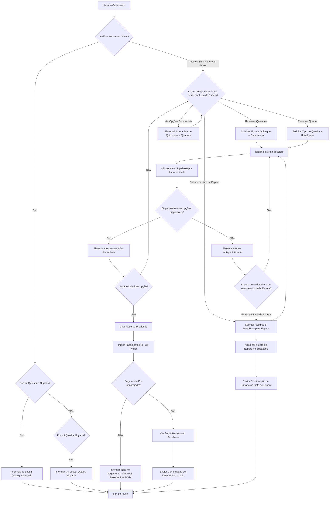
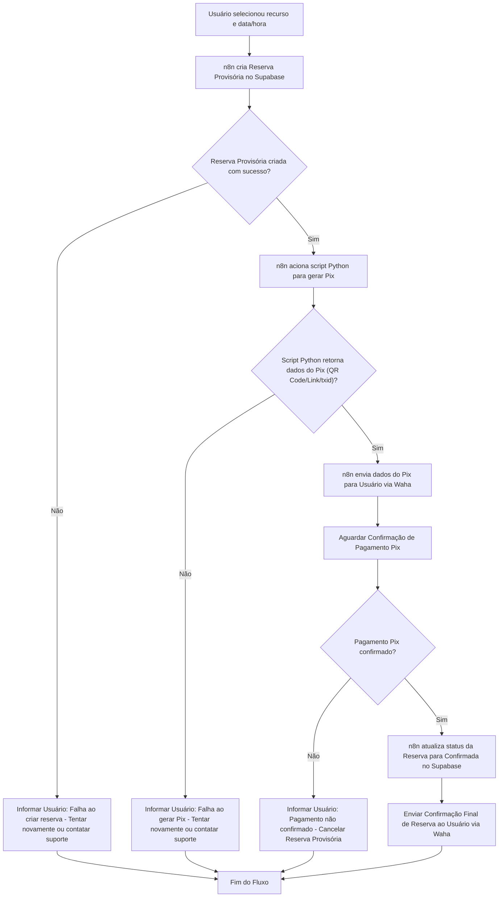
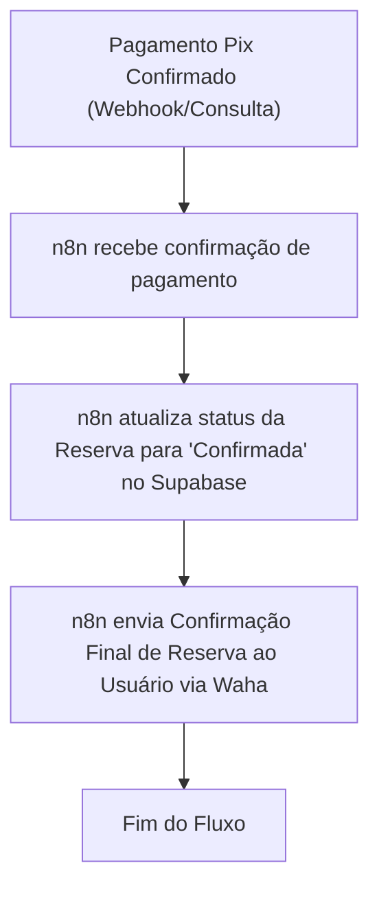
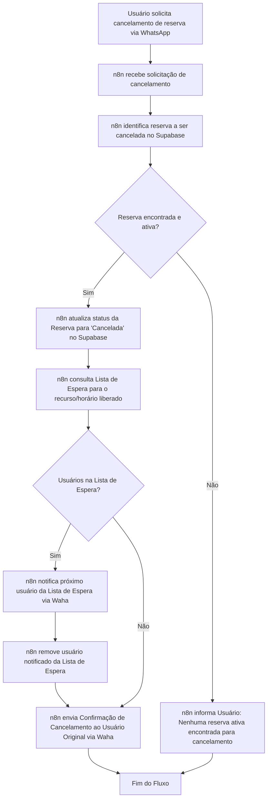
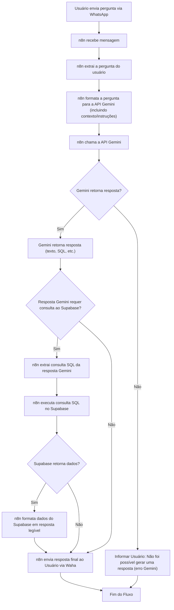
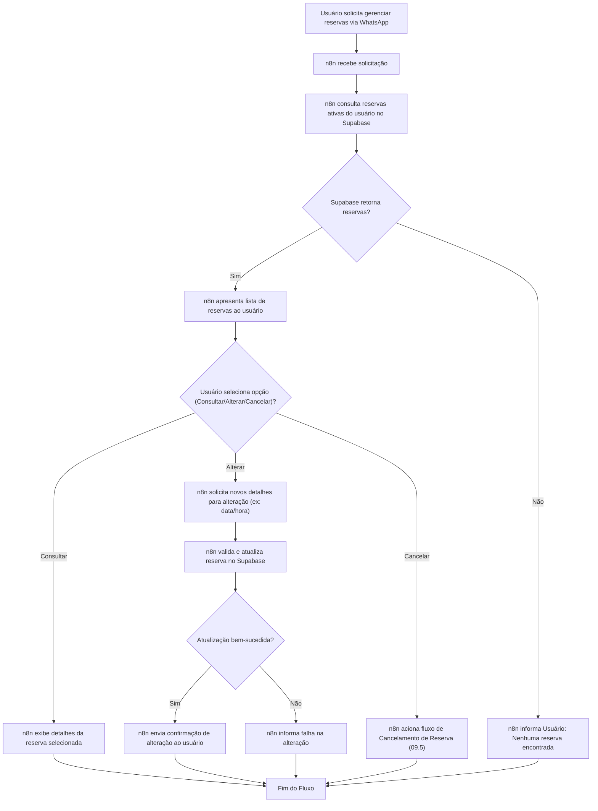
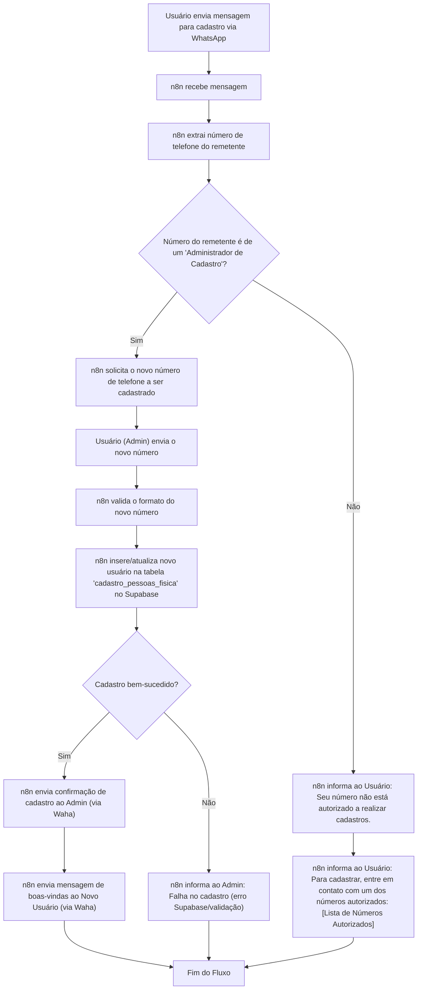

# 1. Proposta de Solução: Sistema de Reserva via WhatsApp (Documento 09)

## 1.1. Visão Geral
Este documento, de número 09, detalha a proposta para a criação de um sistema de reserva de quiosques e quadras de beach tennis via WhatsApp, utilizando Waha, n8n, Docker, Supabase e Gemini. O sistema permitirá que usuários cadastrados realizem reservas, efetuem pagamentos via Pix e gerenciem cancelamentos com notificação de lista de espera.

## 1.2. Arquitetura Proposta
A solução será baseada em uma arquitetura modular e escalável, utilizando as tecnologias especificadas:

### 1.2.1. Integração WhatsApp (Waha)
- Um contêiner Docker dedicado para o Waha, atuando como a interface principal com a API do WhatsApp. Ele será responsável por receber mensagens e enviá-las para o n8n, bem como enviar respostas de volta aos usuários.

### 1.2.2. Orquestração de Fluxos (n8n)
- Um contêiner Docker para o n8n, que será o "cérebro" da aplicação. Ele orquestrará todo o fluxo de reserva, desde o recebimento da mensagem no WhatsApp até a interação com o banco de dados, a lógica de pagamento e a geração de respostas via Gemini.

### 1.2.3. Banco de Dados (Supabase)
- O Supabase será utilizado como o serviço de banco de dados, armazenando todas as informações cruciais: cadastro de pessoas físicas, detalhes dos quiosques e quadras, registros de reservas, status de pagamento e a lista de espera.

### 1.2.4. Inteligência Artificial (Gemini)
- Integrado via n8n, o Gemini será utilizado para interpretar as mensagens dos usuários no WhatsApp e gerar respostas inteligentes, consultando o Supabase para obter informações relevantes (disponibilidade, status de reserva, etc.).

### 1.2.5. Pagamento (Pix)
- A integração com Pix será gerenciada pelo n8n. O n8n acionará um script Python para gerar o QR Code Pix ou link de pagamento (utilizando as APIs do Mercado Pago ou Itaú). Após a geração, o n8n enviará essa informação via Waha para o WhatsApp.
- O `txid` do Pix terá o formato `CEL_{NUMERO_CELULAR}_PED_{NUMERO_PEDIDO}`, permitindo a rastreabilidade do pagamento por reserva.

## 1.3. Funcionalidades Principais

### 1.3.1. Escuta e Resposta WhatsApp
- Recebimento de mensagens dos usuários.
- Envio de mensagens de confirmação, status e notificações.

### 1.3.2. Gestão de Reservas
- Verificação do cadastro do número de celular na tabela de pessoas físicas.
- Exibição da disponibilidade de quiosques e quadras de beach tennis.
- Processo de seleção de horário e recurso.
- Confirmação da reserva mediante pagamento Pix.

### 1.3.3. Gestão de Pagamento Pix
- Geração de QR Code Pix ou link de pagamento (via script Python acionado pelo n8n).
- Verificação do status do pagamento.

### 1.3.4. Cancelamento e Lista de Espera
- Funcionalidade para o usuário cancelar uma reserva.
- Notificação automática do próximo da lista de espera em caso de cancelamento.

### 1.3.5. Respostas Inteligentes com Gemini
- Gemini interpretará as perguntas dos usuários e, com base em consultas SQL específicas ao Supabase, fornecerá respostas relevantes sobre reservas, disponibilidade, etc.

## 1.4. Próximos Passos (Implementação)

1.  **1.4.1. Definição do Esquema do Banco de Dados:** Criar as tabelas necessárias no Supabase.
2.  **1.4.2. Configuração Docker Compose:** Montar o ambiente com Waha, n8n e integração com Supabase.
3.  **1.4.3. Desenvolvimento dos Workflows n8n:** Implementar a lógica de negócios, integração com WhatsApp, Supabase e Gemini.
4.  **1.4.4. Integração Pix:** Desenvolver a parte de pagamento.
5.  **1.4.5. Testes:** Realizar testes de ponta a ponta.

## 1.5. Perguntas para Refinamento

Para que eu possa detalhar o plano e iniciar a implementação, preciso de algumas informações adicionais sobre o banco de dados:

### 1.5.1. Tabela `cadastro_pessoas_fisica`
- Qual o nome exato da tabela?
- Qual o nome da coluna que armazena o número de celular?
- Existem outras colunas importantes que devo considerar para o cadastro?

### 1.5.2. Nomes de Tabelas e Colunas
- Você tem preferência por nomes de tabelas e colunas para:
    - Quiosques (ex: `quiosques`, com colunas `id`, `nome`, `capacidade`, `localizacao`?)
    - Quadras de Beach Tennis (ex: `quadras_beach_tennis`, com colunas `id`, `nome`, `tipo_quadra`, `iluminacao`?)
    - Reservas (ex: `reservas`, com colunas `id`, `id_pessoa`, `id_recurso`, `tipo_recurso` (quiosque/quadra), `data_hora_inicio`, `data_hora_fim`, `status` (confirmada, cancelada, pendente), `valor`, `pix_id`?)
    - Lista de Espera (ex: `lista_espera`, com colunas `id`, `id_pessoa`, `id_recurso`, `tipo_recurso`, `data_hora_solicitacao`?)

### 1.5.3. Escopo Específico da `SELECT` para Gemini
- Poderia dar exemplos de perguntas que o usuário faria ao WhatsApp e que o Gemini deveria responder consultando o banco de dados? Isso me ajudará a definir as `SELECT`s que o Gemini precisará executar.

## 1.6. Fluxos Detalhados

### 1.6.1. Recepção de Mensagem WhatsApp e Verificação de Usuário (09.1)

### 1.6.2. Disponibilidade e Seleção de Recurso (09.2)

### 1.6.3. Criação de Reserva e Iniciação de Pix (09.3)

### 1.6.4. Confirmação de Pagamento Pix e Finalização de Reserva (09.4)

### 1.6.5. Cancelamento de Reserva e Notificação de Lista de Espera (09.5)

### 1.6.6. Respostas Inteligentes com Gemini (09.6)

### 1.6.7. Gerenciamento de Reservas Existentes (09.7)

### 1.6.8. Fluxo de Cadastro de Novo Usuário (09.8)

